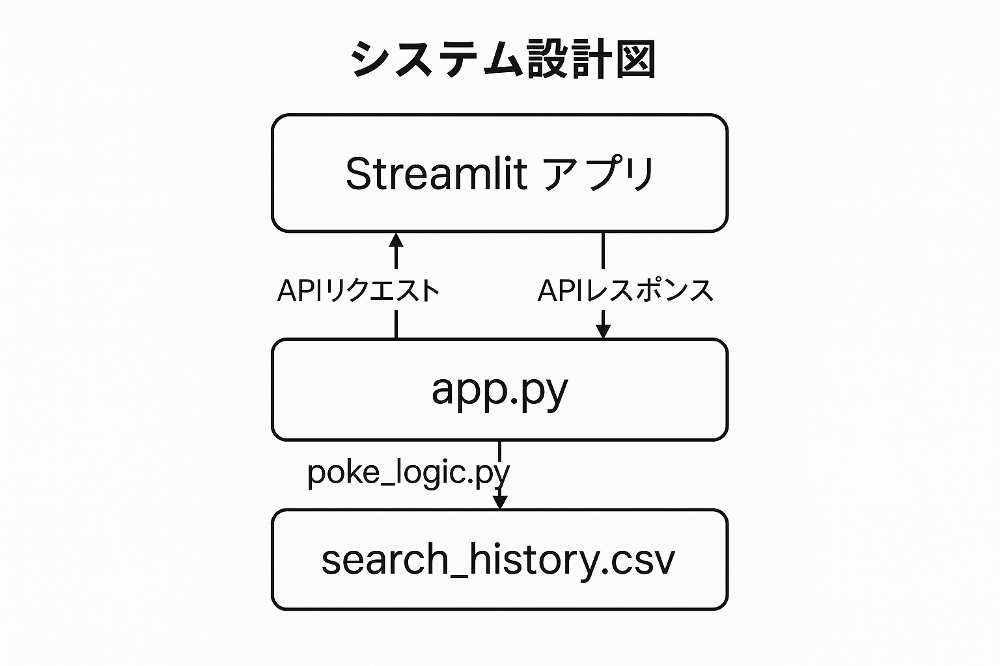
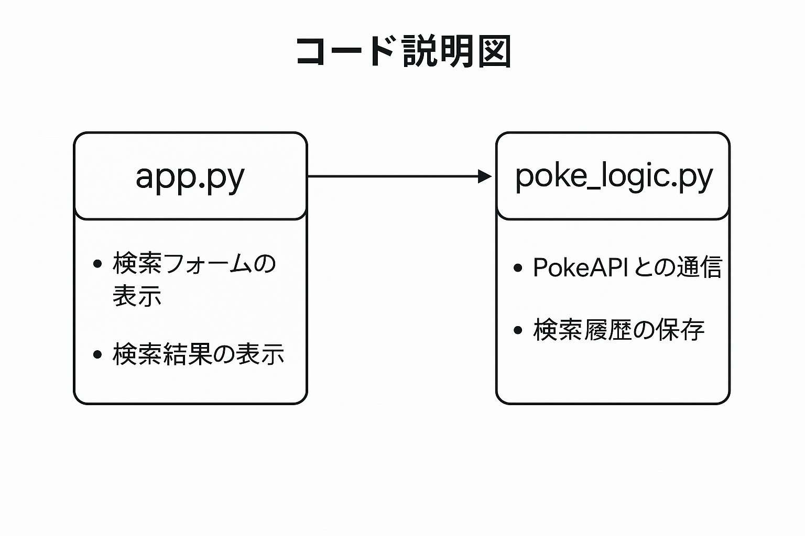

# ポケモン図鑑アプリ（AIプログラミング課題2）

## 概要

このアプリは、PokeAPIを利用してポケモンの情報を検索・表示するWebアプリです。  
ユーザーがポケモン名を入力すると、以下の情報を表示します：

- ポケモンの画像
- タイプ（例：でんき）
- 基本ステータス（HP、こうげき、ぼうぎょなど）
- 検索履歴（CSVに保存）

---

### 使用API

- [PokeAPI](https://pokeapi.co/)  
  → APIキー不要で利用できる、無料のポケモン情報API

### 使用ライブラリ

- `streamlit`：WebアプリのUI構築
- `requests`：APIへのアクセス
- `pandas`：履歴のCSV表示
- `csv`：履歴保存に使用

---

## ファイル構成

├── app.py # Streamlitアプリ本体
├── logic/
│ └── poke_logic.py # API通信・CSV保存ロジック
├── data/
│ └── search_history.csv # 検索履歴（実行時に自動作成）
├── README.md # このファイル
├── requirements.txt # 必要パッケージ一覧

## システム設計図

## コード説明図

## 動かすとき

1. cd C:\pokemon_api
↑　Dドライブにこのファイルがあるなら、cd D:\pokemon_api です。
2. streamlit run app.py
